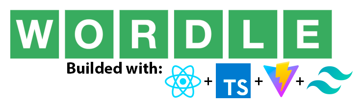

<div id="top"></div>

<!-- PROJECT SHIELDS -->
<!--
*** I'm using markdown "reference style" links for readability.
*** Reference links are enclosed in brackets [ ] instead of parentheses ( ).
*** See the bottom of this document for the declaration of the reference variables
*** for contributors-url, forks-url, etc. This is an optional, concise syntax you may use.
*** https://www.markdownguide.org/basic-syntax/#reference-style-links
-->

[![Contributors][contributors-shield]][contributors-url]
[![Forks][forks-shield]][forks-url]
[![Stargazers][stars-shield]][stars-url]
[![Issues][issues-shield]][issues-url]
[![MIT License][license-shield]][license-url]
[![LinkedIn][linkedin-shield]][linkedin-url]

<!-- PROJECT LOGO -->
<div align="center">
  <a href="https://github.com/jesusvallez/react-ts-tailwind-wordle">
    
  </a>
  <h1 align="center">Wordle</h1>
  <p align="center">
    An awesome game called WORDLE builded with react, typescript, vite and tailwind css
    <br />
    <a href="https://github.com/jesusvallez/react-ts-tailwind-wordle"><strong>Explore the docs »</strong></a>
    <br />
    <br />
    <a href="https://react-ts-tailwind-wordle.netlify.app/">View Demo</a>
    -
    <a href="https://github.com/jesusvallez/react-ts-tailwind-wordle/issues">Report Bug</a>
    ·
    <a href="https://github.com/jesusvallez/react-ts-tailwind-wordle/issues">Request Feature</a>
  </p>
</div>

<!-- GETTING STARTED -->

## Getting Started

To get a local copy up and running follow these simple example steps.

### Installation

1. Clone the repo
   ```sh
   git clone git@github.com:jesusvallez/react-ts-tailwind-wordle.git
   ```
2. Install NPM packages with Yarn
   ```sh
   npm i
   ```
3. To start web
   ```js
   npm run dev
   ```
   <p align="right">(<a href="#top">back to top</a>)</p>

<!-- Interesting links -->

## Interesting links

Here you have an interesting links to improve in tailwind

- 🔗 https://tailwindcomponents.com/cheatsheet/
- 🔗 https://tailwindcss.com/docs/customizing-colors
- 🔗 https://tailwind.simeongriggs.dev/
- 🔗 https://www.creative-tim.com/learning-lab/tailwind-starter-kit
- 🔗 https://www.hyperui.dev/
- 🔗 https://daisyui.com/
<p align="right">(<a href="#top">back to top</a>)</p>

<!-- ROADMAP -->

## Roadmap

- [x] Add Changelog
- [x] Add jest tests
- [x] Create keyboard component
- [x] Improve responsive layout
  - [x] Board
  - [x] Keyboard
- [ ] Animations
  - [x] Add custom animation to scale word
  - [ ] Add custom animation to animate cell with bounce
- [ ] Add darkmode
  - [x] Create hook to get darkmode
  - [x] Card darkmode
  - [ ] Modal darkmode
  - [x] keyboard darkmode

<p align="right">(<a href="#top">back to top</a>)</p>

<!-- MARKDOWN LINKS & IMAGES -->
<!-- https://www.markdownguide.org/basic-syntax/#reference-style-links -->

[contributors-shield]: https://img.shields.io/github/contributors/jesusvallez/react-ts-tailwind-wordle.svg?style=for-the-badge
[contributors-url]: https://github.com/jesusvallez/react-ts-tailwind-wordle/graphs/contributors
[forks-shield]: https://img.shields.io/github/forks/jesusvallez/react-ts-tailwind-wordle.svg?style=for-the-badge
[forks-url]: https://github.com/jesusvallez/react-ts-tailwind-wordle/network/members
[stars-shield]: https://img.shields.io/github/stars/jesusvallez/react-ts-tailwind-wordle.svg?style=for-the-badge
[stars-url]: https://github.com/jesusvallez/react-ts-tailwind-wordle/stargazers
[issues-shield]: https://img.shields.io/github/issues/jesusvallez/react-ts-tailwind-wordle.svg?style=for-the-badge
[issues-url]: https://github.com/jesusvallez/react-ts-tailwind-wordle/issues
[license-shield]: https://img.shields.io/github/license/jesusvallez/react-ts-tailwind-wordle.svg?style=for-the-badge
[license-url]: https://github.com/jesusvallez/react-ts-tailwind-wordle/blob/master/LICENSE.txt
[linkedin-shield]: https://img.shields.io/badge/-LinkedIn-black.svg?style=for-the-badge&logo=linkedin&colorB=555
[linkedin-url]: https://linkedin.com/in/jesusvallez
[product-screenshot]: images/screenshot.png
